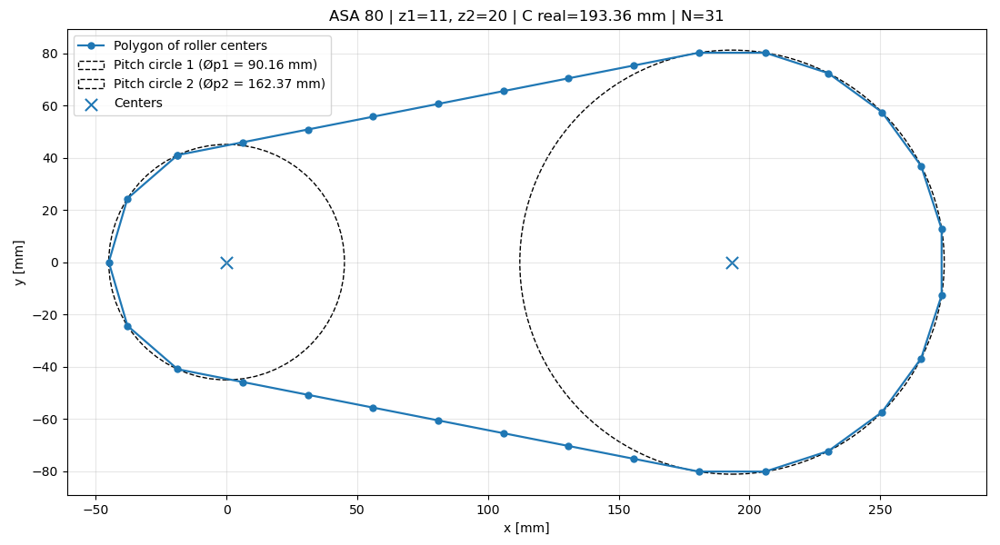
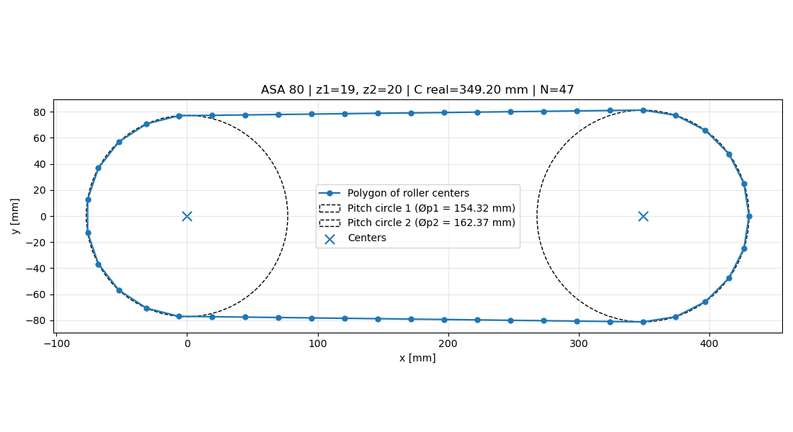
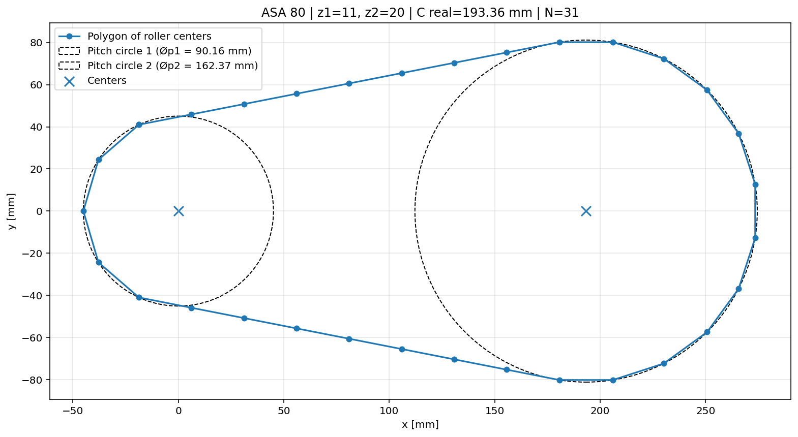
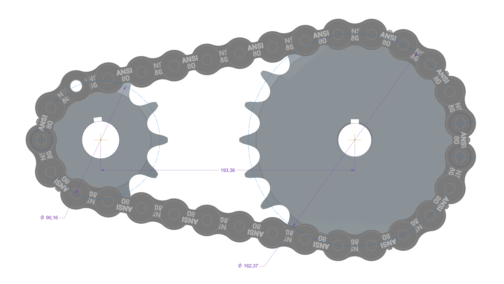
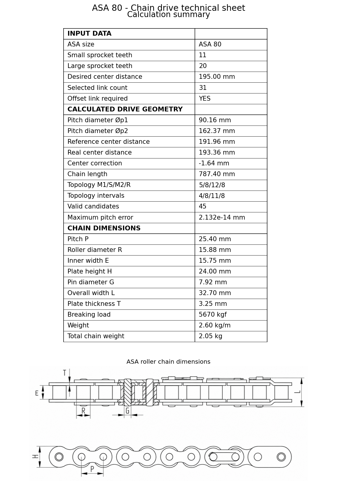
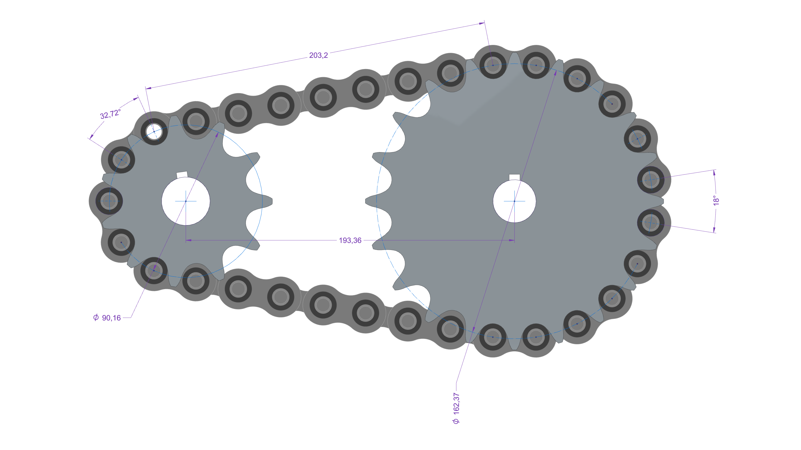

# Chain Drive Geometry Calculator

Python tool for ASA roller chain drive geometry, link count calculation, sprocket pitch diameters, and corrected center distance using a discrete polygonal roller-center model.

This project was developed to support mechanical design workflows where a roller chain drive must be calculated, visualized, and validated before CAD assembly.

Unlike classical continuous chain-length calculators, this tool computes the final geometry from a valid discrete topology of roller centers and pitch intervals.

---

## Overview

Chain drives are often estimated using continuous formulas based on pitch circles, tangent segments, and arc lengths. These formulas are useful for preliminary calculations, but the actual chain is not a continuous curve. It is a sequence of rigid pitch intervals connecting discrete roller centers.

This project models the final chain path as a closed polygon formed by roller centers.

The continuous formulation is used only to estimate the initial link count and guide the generation of candidate topologies. The final corrected center distance is computed from the selected discrete polygonal topology.

---

## Why this project exists

In CAD-based mechanical design, an approximate chain path is often not enough.

Even if the physical chain has clearance, manufacturing tolerances, wear, and elastic effects, the CAD assembly still needs a geometrically consistent reference path. If the roller-center trajectory does not match an integer number of pitch intervals, the CAD assembly may not close without artificial deformation, manual adjustment, or geometric inconsistency.

This tool was created to reduce trial-and-error during chain drive layout by providing:

* corrected center distance;
* integer link count;
* pitch diameters;
* roller-center polygon;
* contact topology;
* offset link indication;
* CAD validation reference.

---

## Key idea

The core topological relation is:

```text
(M1 - 1) + S + (M2 - 1) + R = N
```

Where:

* `M1` = number of rollers in contact with the smaller sprocket;
* `M2` = number of rollers in contact with the larger sprocket;
* `S` = number of pitch intervals in the upper straight run;
* `R` = number of pitch intervals in the lower straight run;
* `N` = total number of chain links.

If `M` rollers are in contact with a sprocket, there are `M - 1` pitch intervals along that contact arc.

This distinction is important because rollers are physical contact elements, while links are pitch intervals between consecutive roller centers.

The symmetry rule used by the model is:

```text
q = (M - 1) / 2
```

This handles both cases:

* odd `M`: one roller lies on the symmetry axis;
* even `M`: the symmetry axis lies halfway between two rollers.

---

## Features

* ASA roller chain catalog embedded in the script.
* ENCO sprocket tooth options embedded in the script.
* Sprocket pitch diameter calculation.
* Maximum outer diameter estimate.
* Minimum center distance validation.
* Continuous chain length estimate.
* Integer link count selection.
* Offset link requirement detection.
* Discrete polygonal roller-center topology.
* Corrected real center distance calculation.
* Pitch-error validation.
* Self-intersection check.
* Polygonal chain layout plot.
* Technical sheet output with chain dimensions.
* CAD validation figures included in the documentation.

---

## Example results

### Case 1 — ASA 80, 11 / 20 teeth

Input:

```text
Chain size: ASA 80
Small sprocket: 11 teeth
Large sprocket: 20 teeth
Desired center distance: 195 mm
```

Result:

```text
Selected links: 31
Topology M1/S/M2/R: 5/8/12/8
Corrected center distance: approximately 193.36 mm
Offset link required: yes
```



### Case 2 — ASA 80, 19 / 20 teeth

Input:

```text
Chain size: ASA 80
Small sprocket: 19 teeth
Large sprocket: 20 teeth
Desired center distance: 350 mm
```

Result:

```text
Selected links: 47
Topology M1/S/M2/R: 10/14/11/14
Corrected center distance: approximately 349.20 mm
Offset link required: yes
```

This case is relevant because `M1 = 10` is even. Therefore, the symmetry axis does not pass through a roller center; it passes halfway between two rollers.



---

## CAD validation

The calculated polygonal geometry was compared with CAD assemblies to verify that the roller-center path can be reproduced in a mechanical design environment.

### Validation case 1





### Validation case 2





---

## Installation

Clone the repository:

```bash
git clone https://github.com/douglasdschons/chain-drive-geometry-calculator.git
cd chain-drive-geometry-calculator
```

Create and activate a virtual environment.

On Windows:

```bash
python -m venv .venv
.venv\Scripts\activate
```

On macOS/Linux:

```bash
python3 -m venv .venv
source .venv/bin/activate
```

Install dependencies:

```bash
pip install -r requirements.txt
```

Required packages:

```text
matplotlib
numpy
scipy
```

---

## Usage

Run the main script from the repository root:

```bash
python src/chain_drive_geometry_calculator.py
```

The current version is an interactive engineering script. It asks for:

* ASA chain size;
* smaller sprocket tooth count;
* larger sprocket tooth count;
* desired center distance.

Then it computes:

* estimated continuous link count;
* adopted integer link count;
* offset link requirement;
* corrected real center distance;
* sprocket pitch diameters;
* polygonal topology;
* roller-center layout;
* technical sheet.

---

## Programmatic usage

The solver can also be used from Python code.

```python
from src.chain_drive_geometry_calculator import solve_symmetric_polygonal_center_distance

result = solve_symmetric_polygonal_center_distance(
    pitch_mm=25.40,
    z1=11,
    z2=20,
    desired_center_distance_mm=195.0,
    selected_links=31,
)

print(result["real_center_distance_mm"])
print(result["topology"].roller_label())
```

Example output:

```text
193.36...
5/8/12/8
```

---

## Documentation

The complete mathematical formulation is available in:

```text
docs/complete_mathematical_formulation_en.pdf
docs/complete_mathematical_formulation_en.tex
```

The documentation explains:

* the continuous reference formulation;
* the discrete roller-center model;
* the topology equation;
* the symmetry rule;
* the center distance calculation;
* the validation criteria;
* CAD validation examples;
* limitations and future work.

---

## Repository structure

```text
chain-drive-geometry-calculator/
│
├── README.md
├── requirements.txt
├── .gitignore
├── LICENSE
│
├── src/
│   └── chain_drive_geometry_calculator.py
│
├── assets/
│   └── enco_asa_dimensions.png
│
└── docs/
    ├── complete_mathematical_formulation_en.tex
    ├── complete_mathematical_formulation_en.pdf
    └── figures/
        ├── plot_1.png
        ├── plot_2.png
        ├── cd_1.png
        ├── cd_2.png
        ├── polygonal_layout_asa80_11_20.png
        └── polygonal_layout_asa80_19_20.png
```

---

## Current scope

This project currently assumes:

* open chain drive;
* two sprockets;
* parallel shafts;
* sprocket centers aligned on the horizontal axis;
* no idler sprocket;
* no tensioner;
* symmetric straight runs;
* ideal roller centers;
* pitch circles used as geometric references;
* no load analysis;
* no power rating calculation;
* no fatigue analysis;
* no dynamic simulation.

---

## Limitations

This is a geometric design tool, not a complete chain drive selection software.

It does not currently calculate:

* transmitted power;
* service factor;
* chain tension;
* fatigue life;
* lubrication requirements;
* wear;
* vibration;
* polygonal speed fluctuation;
* dynamic contact forces.

The calculated geometry should be interpreted as a CAD-oriented geometric reference and should be validated against the design requirements, manufacturer data, and applicable engineering standards before use in real machinery.

---

## Roadmap

Planned improvements:

* Streamlit web interface.
* Exportable reports.
* Additional chain standards.
* Automatic image export.
* CAD-friendly coordinate export.
* Multi-sprocket chain paths.
* Idler and tensioner support.
* Chain speed calculation.
* Basic power and load checks.
* Package structure for installation with `pip`.

---

## Author

**Douglas Delorenzi Schons**
Mechanical Engineer developing technical software, engineering automation, mathematical models, and applied Python tools for mechanical design.

GitHub: [douglasdschons](https://github.com/douglasdschons)

---

## License

This project is licensed under the MIT License.

See the [LICENSE](LICENSE) file for details.

---

## Disclaimer

This tool is provided for educational, computational, and preliminary engineering design purposes.

The author is not responsible for improper use, incorrect design decisions, manufacturing errors, machine failure, or safety-critical applications based solely on this software.

Always verify the final design using manufacturer data, engineering judgment, applicable standards, and CAD/physical validation when necessary.
